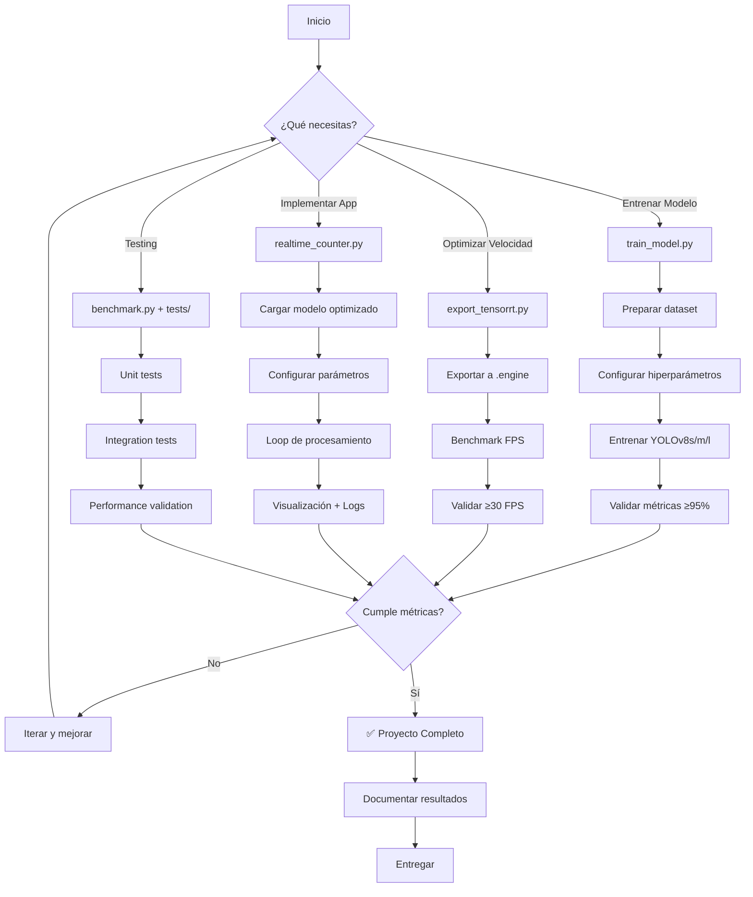

# 📋 CONTEXTO COMPLETO DEL PROYECTO - SISTEMA DE CONTROL DE AFORO CON VISIÓN ARTIFICIAL

## 🎓 INFORMACIÓN DEL PROYECTO

**Institución:** Universidad Surcolombiana  
**Estudiante:** Julian  
**Título:** Sistema Inteligente de Control de Aforo mediante Visión Artificial  
**Tecnología Principal:** YOLOv8 / YOLO11 (Ultralytics YOLO)  
**Objetivo:** Desarrollar un sistema de conteo de personas en tiempo real usando Deep Learning  

---

## 🎯 OBJETIVO GENERAL

Desarrollar un sistema inteligente de control de aforo que utilice visión artificial para detectar y contar personas en tiempo real, con el fin de gestionar la ocupación de espacios de manera automatizada y precisa.

### Objetivos Específicos:

1. **Implementar modelo de detección de personas** usando YOLOv8 con precisión >95%
2. **Lograr procesamiento en tiempo real** ≥30 FPS en hardware disponible
3. **Desarrollar aplicación de conteo** con interfaz visual y métricas en tiempo real
4. **Optimizar rendimiento** para GPU GTX 1060 6GB
5. **Documentar todo el proceso** con resultados, métricas y análisis

### Estado actual del sistema (2025)

- **Backend actual:** API en Python basada en Flask + Flask-SocketIO, con endpoints REST y configuración expuesta vía Swagger (`/api/docs`), y streaming de vídeo en tiempo real por WebSocket.
- **Frontend actual:** Cliente web/móvil que recibe frames JPEG codificados en base64 por WebSocket, muestra el vídeo con conteo y FPS, y permite iniciar/detener la cámara y ajustar parámetros.
- **Modelos YOLO evaluados en el dataset de prueba (2750 imágenes, 20 974 personas):**

  | Modelo                 | Precisión | Recall | mAP@0.50 | mAP@0.50-0.95 | Tiempo inferencia | FPS solo modelo |
  |------------------------|----------:|-------:|---------:|--------------:|------------------:|----------------:|
  | YOLO11n (oficial)      |    0.9034 | 0.8526 |   0.9107 |        0.4946 |           9.47 ms |        ~105.6   |
  | YOLOv8n v3 (custom)    |    0.8692 | 0.8537 |   0.8816 |        0.4291 |           8.79 ms |        ~113.7   |
  | YOLOv8s (custom)       |    0.9923 | 0.9905 |   0.9946 |        0.8835 |          20.63 ms |         ~48.5   |
  | YOLOv8m (oficial)      |    0.9925 | 0.9909 |   0.9946 |        0.8861 |          46.87 ms |         ~21.3   |
  | YOLOv8l (custom)       |    0.9924 | 0.9906 |   0.9947 |        0.8899 |          82.10 ms |         ~12.2   |

- **Compromiso velocidad/precisión recomendado para tiempo real:** usar un modelo tipo YOLOv8s customizado (alta precisión y FPS suficientes para superar los 30 FPS en el sistema completo), dejando modelos más grandes (YOLOv8m/l) para análisis offline o validaciones.
- **Uso en producción/demos:** el sistema puede usar un modelo ligero (YOLO11n o YOLOv8n) cuando la prioridad absoluta es mantener FPS muy altos, y cambiar a modelos YOLOv8s/m/l cuando la prioridad es la precisión.

---

## 🖥️ HARDWARE Y RECURSOS DISPONIBLES

### Especificaciones del Sistema:
```yaml
GPU: NVIDIA GeForce GTX 1060 6GB
  - CUDA Cores: 1280
  - VRAM: 6GB GDDR5
  - Compute Capability: 6.1
  
CPU: AMD Ryzen 5 3600
  - Cores/Threads: 6/12
  - Base Clock: 3.6 GHz
  - Max Boost: 4.2 GHz

RAM: 64GB DDR4

Storage: SSD (para datasets e imágenes)

OS: Ubuntu 24 / Windows 11 (dual boot)
```

### Software Stack:
```yaml
Python: 3.8+
CUDA: 11.x / 12.x
PyTorch: Latest con CUDA support
Ultralytics: YOLOv8 framework
OpenCV: 4.x
TensorRT: Para optimización (opcional)
```

---

## 📊 MÉTRICAS Y CRITERIOS DE EVALUACIÓN

### Métricas de Rendimiento del Modelo:

#### OBLIGATORIAS (Criterios Académicos):
```yaml
Precisión (Precision): ≥95%
  - Actual YOLOv8n: 90.1%
  - Target: 95%+
  - Estrategia: Entrenar modelos más grandes (YOLOv8s/m/l/x)

Recall: ≥90%
  - Actual YOLOv8n: 84.8%
  - Target: 90%+

mAP@50: ≥90%
  - Actual YOLOv8n: 88.6%
  - Target: 90%+

mAP@50-95: ≥85%
  - Para evaluación comprehensiva
```

#### DESEABLES (Rendimiento en Tiempo Real):
```yaml
FPS (Frames Per Second): ≥30 FPS
  - Mínimo aceptable: 30 FPS
  - Objetivo: 45-60 FPS
  - Estrategia: TensorRT, optimizaciones

Latencia: <50ms por frame
  - Para aplicaciones en tiempo real

Uso de VRAM: ≤5GB
  - Dejar margen en GTX 1060 6GB
```

### Métricas de la Aplicación:

```yaml
Precisión de Conteo: ≥95%
  - Contar correctamente personas en frame
  - Minimizar falsos positivos/negativos

Estabilidad: 
  - Sin crashes durante operación continua
  - Manejo robusto de errores

Usabilidad:
  - Interfaz intuitiva
  - Visualización clara de métricas
  - Feedback en tiempo real
```

---

## 🏗️ ARQUITECTURA DEL SISTEMA

### Componentes Principales:

```
┌─────────────────────────────────────────────────────────────┐
│                    SISTEMA DE AFORO                         │
├─────────────────────────────────────────────────────────────┤
│                                                             │
│  ┌───────────────┐      ┌──────────────┐                   │
│  │  Captura de   │─────▶│  Preproceso  │                   │
│  │    Video      │      │   (resize,   │                   │
│  │ (Cámara/File) │      │  normalize)  │                   │
│  └───────────────┘      └──────┬───────┘                   │
│                                │                            │
│                                ▼                            │
│                    ┌────────────────────┐                   │
│                    │  Modelo YOLOv8     │                   │
│                    │  Detección Personas│                   │
│                    │  (GPU Accelerated) │                   │
│                    └─────────┬──────────┘                   │
│                              │                              │
│                              ▼                              │
│                 ┌─────────────────────────┐                 │
│                 │  Post-procesamiento     │                 │
│                 │  • NMS                  │                 │
│                 │  • Filtrado confianza   │                 │
│                 │  • Conteo               │                 │
│                 └──────────┬──────────────┘                 │
│                            │                                │
│              ┌─────────────┴─────────────┐                  │
│              ▼                           ▼                  │
│   ┌──────────────────┐       ┌──────────────────┐          │
│   │  Visualización   │       │    Métricas      │          │
│   │  • Bounding Boxes│       │  • Count         │          │
│   │  • Confianza     │       │  • FPS           │          │
│   │  • Conteo        │       │  • Precision     │          │
│   └──────────────────┘       └──────────────────┘          │
│                                                             │
│              ┌──────────────────────┐                       │
│              │  Logging/Storage     │                       │
│              │  • CSV logs          │                       │
│              │  • Video recording   │                       │
│              │  • Estadísticas      │                       │
│              └──────────────────────┘                       │
└─────────────────────────────────────────────────────────────┘
```

---

## 🤖 MODELO DE DETECCIÓN

### Estado Actual:

```yaml
Modelo Base: YOLOv8n (nano)
  - Parámetros: 3.2M
  - Tamaño: ~6MB

Dataset:
  - Fuente: Roboflow
  - Total Imágenes: ~25,000
  - Formato: COCO JSON
  - Anotaciones: Bounding boxes de personas
  - Conversión: De rotated boxes a standard boxes

Entrenamiento Actual (YOLOv8n):
  - Épocas completadas: 56 (EarlyStopping)
  - Precision: 90.1%
  - Recall: 84.8%
  - mAP@50: 88.6%
  - mAP@50-95: ~65%

Hardware Entrenamiento:
  - GPU: GTX 1060 6GB
  - Batch size: 16
  - Tiempo: ~4-6 horas
```

### Plan de Mejora (Para alcanzar >95% precisión):

```yaml
Estrategia 1: Modelos más grandes
  - YOLOv8s (11M params)
  - YOLOv8m (25M params)  
  - YOLOv8l (43M params)
  - YOLOv8x (68M params)
  
  Expectativa:
    - YOLOv8s: ~92-93% precision
    - YOLOv8m: ~94-95% precision ✓
    - YOLOv8l: ~95-96% precision ✓
    - YOLOv8x: ~96-97% precision ✓

Estrategia 2: Optimización de hiperparámetros
  - Data augmentation más agresivo
  - Learning rate scheduling
  - Más épocas (100-300)
  - Validación cruzada

Estrategia 3: Data quality
  - Limpieza de dataset
  - Balanceo de clases
  - Más data augmentation
```

---

## 💻 APLICACIÓN DE CONTEO EN TIEMPO REAL

### Funcionalidades Requeridas:

#### 1. Captura de Video
```python
Fuentes Soportadas:
  - Webcam (índice 0, 1, 2...)
  - Archivo de video (.mp4, .avi, .mov)
  - Stream RTSP (cámaras IP)
  - Múltiples fuentes simultáneas (futuro)
```

#### 2. Detección y Conteo
```python
Funciones Core:
  - Detectar personas en cada frame
  - Contar personas detectadas
  - Filtrar por confianza (threshold)
  - Aplicar NMS para eliminar duplicados
  - Tracking temporal (opcional)
```

#### 3. Visualización
```python
Elementos en Pantalla:
  - Bounding boxes en personas detectadas
  - Score de confianza por detección
  - Conteo total en tiempo real
  - FPS actual
  - Métricas de rendimiento
  - Historial de conteo (gráfica opcional)

Colores:
  - Verde: Alta confianza (>0.7)
  - Amarillo: Confianza media (0.5-0.7)
  - Rojo: Baja confianza (<0.5)
```

#### 4. Configuración
```python
Parámetros Ajustables:
  - Resolución de entrada (384, 416, 512, 640)
  - Threshold de confianza (0.3-0.9)
  - IoU threshold para NMS
  - Modelo a usar (.pt, .engine)
  - Fuente de video
  - Guardar output (sí/no)
```

#### 5. Métricas y Logging
```python
Métricas en Tiempo Real:
  - FPS actual y promedio
  - Conteo actual
  - Conteo promedio (ventana temporal)
  - Conteo máximo detectado
  - Latencia por frame

Logging:
  - Timestamp de cada frame
  - Conteo por frame
  - Coordenadas de detecciones
  - Confianzas
  - Export a CSV/JSON
```

#### 6. Optimizaciones
```python
Técnicas de Aceleración:
  - FP16 precision (half=True)
  - TensorRT engine (.engine)
  - Reducción de resolución estratégica
  - Skip frames (procesar 1 de cada N)
  - Batch processing
  - GPU acceleration (device=0)
```

---

## 📝 ESPECIFICACIONES TÉCNICAS DETALLADAS

### Interfaz de Usuario (Requisitos):

```yaml
Modo de Operación:
  - CLI (Command Line Interface) con argumentos
  - Ventana OpenCV para visualización
  - Output opcional a archivo

Controles:
  - 'q': Salir
  - 's': Guardar screenshot
  - 'p': Pausar/Reanudar
  - 'r': Resetear contadores
  - '+/-': Ajustar confianza threshold
  - ESC: Salir

Display Elements:
  Top-left:
    - Conteo de personas
    - FPS actual
  Top-right:
    - Configuración actual
    - Modelo usado
  Bottom:
    - Barra de progreso (si es video)
    - Status messages
```

### Configuraciones de Rendimiento:

```yaml
ultra_fast:
  resolution: 384x384
  conf_threshold: 0.5
  iou_threshold: 0.6
  max_detections: 50
  skip_frames: 2
  expected_fps: 70-90
  precision: ~85%
  use_case: "Demo rápido, múltiples cámaras"

fast:
  resolution: 416x416
  conf_threshold: 0.45
  iou_threshold: 0.6
  max_detections: 50
  skip_frames: 1
  expected_fps: 60-75
  precision: ~87%
  use_case: "Balance velocidad alta"

balanced: ⭐ RECOMENDADO
  resolution: 512x512
  conf_threshold: 0.4
  iou_threshold: 0.5
  max_detections: 100
  skip_frames: 0
  expected_fps: 40-55
  precision: ~89%
  use_case: "Balance óptimo velocidad/precisión"

quality:
  resolution: 640x640
  conf_threshold: 0.35
  iou_threshold: 0.45
  max_detections: 300
  skip_frames: 0
  expected_fps: 30-45
  precision: ~90%
  use_case: "Máxima precisión, producción"
```

---

## 🔧 IMPLEMENTACIÓN - REQUISITOS TÉCNICOS

### Estructura del Proyecto:

```
proyecto_aforo/
├── models/
│   ├── yolov8n.pt
│   ├── yolov8s.pt
│   ├── yolov8m.pt
│   ├── yolov8n.engine (TensorRT, opcional)
│   └── best.pt (tu modelo custom entrenado)
│
├── data/
│   ├── dataset/
│   │   ├── images/
│   │   │   ├── train/
│   │   │   ├── val/
│   │   │   └── test/
│   │   └── labels/
│   │       ├── train/
│   │       ├── val/
│   │       └── test/
│   └── dataset.yaml
│
├── scripts/
│   ├── realtime_counter.py         # Script principal ⭐
│   ├── export_tensorrt.py          # Exportar a TensorRT
│   ├── benchmark.py                # Benchmarks
│   ├── train_model.py              # Entrenar modelos
│   └── evaluate_model.py           # Evaluar métricas
│
├── utils/
│   ├── video_utils.py              # Manejo de video
│   ├── metrics.py                  # Cálculo de métricas
│   ├── visualization.py            # Dibujo de boxes, etc.
│   └── logger.py                   # Logging y export
│
├── config/
│   ├── default_config.yaml         # Configuración por defecto
│   └── optimized_configs.yaml      # Configs optimizados
│
├── outputs/
│   ├── videos/                     # Videos procesados
│   ├── logs/                       # Logs CSV/JSON
│   └── screenshots/                # Capturas
│
├── docs/
│   ├── README.md
│   ├── INSTALLATION.md
│   └── API_REFERENCE.md
│
├── requirements.txt
└── setup.py
```

### Dependencias Principales:

```txt
# requirements.txt

# Core Deep Learning
torch>=2.0.0
torchvision>=0.15.0
ultralytics>=8.0.0

# Computer Vision
opencv-python>=4.8.0
opencv-contrib-python>=4.8.0

# Data Processing
numpy>=1.24.0
pandas>=2.0.0
pillow>=10.0.0

# Visualization
matplotlib>=3.7.0
seaborn>=0.12.0

# Optimization (opcional)
nvidia-tensorrt>=8.6.0
onnx>=1.14.0
onnxruntime-gpu>=1.15.0

# Utilities
pyyaml>=6.0
tqdm>=4.65.0
psutil>=5.9.0

# Logging
loguru>=0.7.0

# Configuration
python-dotenv>=1.0.0
```

---

## 🎨 CASOS DE USO ESPECÍFICOS

### Caso de Uso 1: Monitoreo de Entrada
```yaml
Escenario: Control de acceso a edificio
Requerimientos:
  - Alta precisión (>95%)
  - Tiempo real (30+ FPS)
  - Conteo bidireccional (entradas/salidas)
  - Log de eventos con timestamp
  
Configuración:
  - Modelo: YOLOv8m o superior
  - Config: quality
  - Tracking: ByteTrack habilitado
  - Alertas: Cuando aforo > threshold
```

### Caso de Uso 2: Análisis de Ocupación
```yaml
Escenario: Análisis de ocupación de espacios
Requerimientos:
  - Precisión moderada (>90%)
  - Procesamiento batch
  - Generación de reportes
  - Heatmaps de ocupación
  
Configuración:
  - Modelo: YOLOv8s
  - Config: balanced
  - Processing: Batch de videos
  - Output: CSV + visualizaciones
```

### Caso de Uso 3: Sistema de Alertas
```yaml
Escenario: Alertas cuando se excede capacidad
Requerimientos:
  - Tiempo real crítico (45+ FPS)
  - Alertas instantáneas
  - Histórico de eventos
  - Integración con otros sistemas
  
Configuración:
  - Modelo: YOLOv8n + TensorRT
  - Config: fast
  - Alertas: Sound + Email + API
  - Threshold: Configurable
```

---

## 📐 ESPECIFICACIONES DE LA APLICACIÓN PRINCIPAL

### `realtime_counter.py` - Especificación Completa:

```python
"""
Sistema de Conteo de Personas en Tiempo Real
============================================

DESCRIPCIÓN:
    Aplicación que detecta y cuenta personas en video usando YOLOv8,
    optimizada para GTX 1060 6GB con múltiples configuraciones de
    velocidad/precisión.

CARACTERÍSTICAS:
    ✓ Detección de personas con YOLOv8
    ✓ Conteo en tiempo real
    ✓ Múltiples fuentes (webcam, video, RTSP)
    ✓ Visualización con métricas
    ✓ 4 configuraciones preconfiguradas
    ✓ Exportar video procesado
    ✓ Logging de métricas
    ✓ Optimizaciones para GPU

MÉTRICAS OBJETIVO:
    • FPS: ≥30 (quality mode)
    • Precisión: ≥90%
    • Latencia: <50ms por frame

USO:
    python realtime_counter.py --model yolov8n.pt --source 0 --config balanced
"""

# ARGUMENTOS CLI REQUERIDOS:
--model: str
    Ruta al modelo YOLOv8 (.pt o .engine)
    Ejemplos: 'yolov8n.pt', 'best.pt', 'yolov8n.engine'

--source: str | int
    Fuente de video
    0 = Webcam
    'video.mp4' = Archivo
    'rtsp://...' = Stream

--config: str
    Configuración de velocidad/precisión
    Opciones: 'ultra_fast', 'fast', 'balanced', 'quality'
    Default: 'balanced'

# ARGUMENTOS OPCIONALES:
--save: bool
    Guardar video procesado
    Default: False

--output: str
    Ruta de salida para video
    Default: 'output.mp4'

--no-display: bool
    No mostrar ventana (útil para headless)
    Default: False

--conf-threshold: float
    Threshold de confianza manual
    Range: 0.0-1.0
    Default: Auto según config

--log: bool
    Guardar logs CSV
    Default: True

--log-path: str
    Ruta para logs
    Default: 'outputs/logs/'

# FUNCIONES CORE REQUERIDAS:

class RealtimeCounter:
    """Clase principal del contador"""
    
    def __init__(self, model_path, config):
        """
        Inicializar contador con modelo y configuración
        
        Args:
            model_path: Ruta al modelo .pt o .engine
            config: 'ultra_fast' | 'fast' | 'balanced' | 'quality'
        """
        pass
    
    def process_frame(self, frame):
        """
        Procesar un frame individual
        
        Args:
            frame: numpy array (H, W, C)
            
        Returns:
            count: int - número de personas
            annotated_frame: numpy array - frame con anotaciones
            detections: list - lista de detecciones
        """
        pass
    
    def run_video(self, source, save=False, output_path=None):
        """
        Ejecutar contador en video/stream
        
        Args:
            source: Fuente de video
            save: Guardar output
            output_path: Ruta de salida
        """
        pass
    
    def get_statistics(self):
        """
        Obtener estadísticas de la sesión
        
        Returns:
            dict con métricas: fps_avg, count_avg, count_max, etc.
        """
        pass

# MÉTRICAS A CALCULAR Y MOSTRAR:

Tiempo Real:
    - FPS actual
    - FPS promedio (últimos 30 frames)
    - Conteo actual de personas
    - Conteo promedio
    - Latencia por frame (ms)

Post-procesamiento:
    - Total frames procesados
    - FPS promedio sesión
    - Conteo máximo detectado
    - Conteo mínimo detectado
    - Desviación estándar del conteo
    - Tiempo total de procesamiento

# VISUALIZACIÓN REQUERIDA:

En Pantalla:
    • Bounding boxes con colores según confianza
    • Label con confianza por detección
    • Contador principal (grande, visible)
    • FPS (esquina superior izquierda)
    • Configuración actual
    • Barra de FPS visual (verde/amarillo/rojo)

Salida de Video (si --save):
    • Mismo contenido visual
    • Codec: mp4v o h264
    • FPS: Mismo que entrada o 30fps

Logs CSV:
    timestamp, frame_id, count, fps, avg_confidence, detections_json

# OPTIMIZACIONES IMPLEMENTADAS:

GPU:
    ✓ Usar device=0 siempre
    ✓ FP16 precision (half=True)
    ✓ Optimizar tamaño de batch

Procesamiento:
    ✓ Reducción de resolución según config
    ✓ NMS optimizado (iou, conf thresholds)
    ✓ Limitar detecciones máximas
    ✓ Skip frames si configurado

Memoria:
    ✓ Limpiar tensores no usados
    ✓ Usar streaming mode
    ✓ Limitar historial de métricas

# MANEJO DE ERRORES:

CUDA out of memory:
    → Reducir resolución
    → Cerrar otros procesos GPU
    → Usar config ultra_fast

Modelo no encontrado:
    → Mostrar mensaje claro
    → Sugerir descargar modelo

Source no disponible:
    → Verificar dispositivo/archivo
    → Mostrar fuentes disponibles

FPS bajo (<30):
    → Sugerir config más rápido
    → Sugerir TensorRT
    → Mostrar tips de optimización
```

---

## 🧪 TESTING Y VALIDACIÓN

### Tests Requeridos:

```yaml
Unit Tests:
  - test_model_loading()
  - test_inference_single_frame()
  - test_counting_accuracy()
  - test_fps_measurement()
  - test_video_reading()
  - test_output_saving()

Integration Tests:
  - test_full_pipeline()
  - test_different_configs()
  - test_different_sources()
  - test_tensorrt_integration()

Performance Tests:
  - benchmark_fps_by_config()
  - benchmark_precision_by_model()
  - benchmark_memory_usage()
  - stress_test_long_video()

Validation:
  - validate_counting_accuracy()
    → Comparar con ground truth
    → Debe ser >90% correct count
  
  - validate_fps_requirements()
    → Debe lograr ≥30 FPS en quality mode
    
  - validate_precision()
    → Modelo debe tener ≥95% precision
```

---

## 📚 DOCUMENTACIÓN REQUERIDA

### Para el Proyecto:

```markdown
1. README.md principal
   - Descripción del proyecto
   - Instalación
   - Uso básico
   - Ejemplos
   
2. INSTALLATION.md
   - Requisitos del sistema
   - Setup paso a paso
   - Troubleshooting común
   
3. USAGE.md
   - Ejemplos de uso detallados
   - Configuraciones disponibles
   - Tips y trucos
   
4. API_REFERENCE.md
   - Documentación de funciones
   - Parámetros y returns
   - Ejemplos de código
   
5. OPTIMIZATION_GUIDE.md
   - Guía de optimización
   - TensorRT setup
   - Benchmarks
```

### Para la Entrega Académica:

```markdown
1. Documento Principal (Word/PDF)
   - Introducción
   - Marco teórico
   - Metodología
   - Resultados ← IMPORTANTE
   - Conclusiones
   - Referencias
   
2. Anexos
   - Código fuente comentado
   - Resultados de entrenamiento
   - Tablas de benchmarks
   - Capturas de pantalla
   - Diagramas de arquitectura
```

---

## 🎯 CRITERIOS DE ÉXITO (CHECKLIST FINAL)

```yaml
Modelo de Detección:
  ✓ Precisión ≥95%
  ✓ Recall ≥90%
  ✓ mAP@50 ≥90%
  ✓ Entrenado con dataset de 25k+ imágenes
  ✓ Validado con set de prueba independiente

Aplicación:
  ✓ FPS ≥30 en modo quality
  ✓ FPS ≥45 en modo balanced
  ✓ Soporta múltiples fuentes de video
  ✓ Visualización clara de métricas
  ✓ Exporta logs y estadísticas
  ✓ Manejo robusto de errores
  ✓ Código bien documentado

Optimización:
  ✓ Implementa TensorRT (opcional pero recomendado)
  ✓ 4 configuraciones de velocidad/precisión
  ✓ Uso eficiente de GPU (<5GB VRAM)
  ✓ Sin memory leaks en ejecución prolongada

Documentación:
  ✓ README completo
  ✓ Código comentado
  ✓ Documento académico con resultados
  ✓ Evidencias de funcionamiento (videos/screenshots)
  ✓ Análisis de resultados y conclusiones

Testing:
  ✓ Validación con ground truth
  ✓ Benchmarks de rendimiento
  ✓ Pruebas en diferentes condiciones
  ✓ Comparación con baseline
```

---

## 🔄 FLUJO DE TRABAJO COMPLETO

### Para Asistentes de Programación (Windsurf):



---

## 🚀 PRIORIDADES DE DESARROLLO

### FASE 1: MODELO (CRÍTICO) ⚠️
```yaml
Prioridad: ALTA
Tiempo estimado: 5-7 días

Tareas:
  1. Entrenar YOLOv8s (esperar ~92-93% precision)
  2. Si no alcanza 95%, entrenar YOLOv8m
  3. Si es necesario, entrenar YOLOv8l
  4. Validar con test set independiente
  5. Documentar resultados de entrenamiento

Criterio de Avance: Precision ≥95% ✓
```

### FASE 2: OPTIMIZACIÓN (IMPORTANTE)
```yaml
Prioridad: MEDIA-ALTA
Tiempo estimado: 2-3 días

Tareas:
  1. Implementar optimizaciones básicas (FP16, resolución)
  2. Exportar modelo a TensorRT
  3. Crear configuraciones preestablecidas
  4. Benchmark en diferentes configs
  5. Validar ≥30 FPS en quality mode

Criterio de Avance: FPS ≥30 en quality ✓
```

### FASE 3: APLICACIÓN (IMPORTANTE)
```yaml
Prioridad: MEDIA
Tiempo estimado: 3-4 días

Tareas:
  1. Implementar realtime_counter.py completo
  2. Sistema de visualización
  3. Logging y exportación
  4. Manejo de errores robusto
  5. Interfaz CLI con argumentos
  6. Testing básico

Criterio de Avance: App funcional y usable ✓
```

### FASE 4: DOCUMENTACIÓN (NECESARIO)
```yaml
Prioridad: MEDIA
Tiempo estimado: 2-3 días

Tareas:
  1. Código comentado
  2. README técnico
  3. Documento académico
  4. Capturas y videos demo
  5. Análisis de resultados

Criterio de Avance: Documentación completa ✓
```

---

## 📋 INFORMACIÓN ADICIONAL PARA ASISTENTES

### Contexto del Desarrollo:

```yaml
Estado Actual del Proyecto:
  ✓ YOLOv8n entrenado (90.1% precision)
  ✓ Dataset preparado (~25k imágenes)
  ✓ Scripts de optimización creados
  ✗ Precisión <95% (necesita modelo más grande)
  ✗ Aplicación completa no implementada
  ~ Optimizaciones de velocidad en progreso

Decisiones de Diseño Tomadas:
  ✓ Arquitectura: YOLOv8 (mejor que YOLOv7/v5)
  ✓ Framework: Ultralytics (fácil uso)
  ✓ GPU Target: GTX 1060 6GB
  ✓ FPS Target: ≥30 FPS
  ✓ Optimización: TensorRT para aceleración

Evolución del Proyecto:
  • Inicial: Multi-camera tracking system
  • Actual: Sistema de conteo directo simplificado
  • Enfoque: Tiempo real con alta precisión
```

### Hardware y Limitaciones:

```yaml
GPU: GTX 1060 6GB
  Limitaciones:
    - VRAM máximo: 6GB
    - Compute: Relativamente antigua (Pascal)
    - No tiene Tensor Cores
  
  Estrategias:
    - Usar modelos medianos (YOLOv8s/m)
    - TensorRT para acelerar
    - FP16 precision obligatorio
    - Batch size limitado a 12-16

CPU: Ryzen 5 3600
  Suficiente para:
    - Preprocesamiento
    - Post-procesamiento
    - Visualización
    - I/O operations

RAM: 64GB
  Sin problemas para:
    - Cargar datasets grandes
    - Procesamiento batch
    - Múltiples procesos
```

### Tips para Asistentes de Windsurf:

```markdown
Cuando implementes:

1. SIEMPRE verifica GPU disponible antes de correr
   → torch.cuda.is_available()
   → nvidia-smi

2. SIEMPRE usa device=0 para GPU
   → No CPU inference (muy lento)

3. SIEMPRE usa half=True (FP16)
   → 2× más rápido, mismo precision

4. Para debugging:
   → verbose=False (no llenar terminal)
   → Pero logging a archivo sí

5. Para producción:
   → Manejo de errores robusto
   → Try-except en puntos críticos
   → Cleanup de recursos (cap.release())

6. Optimización:
   → TensorRT > ONNX > PyTorch
   → Resolución: 512 mejor balance
   → conf_threshold: 0.4 recomendado

7. Testing:
   → Siempre validar con video real
   → No solo con imágenes sintéticas
   → Medir FPS en condiciones reales
```

---

## 📞 PREGUNTAS FRECUENTES PARA ASISTENTES

### P: ¿Qué modelo debo usar para alcanzar 95% precisión?
```
R: YOLOv8m o YOLOv8l. YOLOv8s probablemente llegue a 92-93%.
   
   Estrategia:
   1. Entrenar YOLOv8s primero (más rápido)
   2. Si no alcanza 95%, entrenar YOLOv8m
   3. YOLOv8l solo si YOLOv8m no alcanza
```

### P: ¿Cómo balancear velocidad vs precisión?
```
R: Usar configuraciones preestablecidas:
   
   Para desarrollo/testing: balanced (40-55 FPS, ~89%)
   Para producción: quality (30-45 FPS, ~90%)
   Para demos: ultra_fast (70-90 FPS, ~85%)
   
   TensorRT da 2-3× velocidad sin perder precisión.
```

### P: ¿Qué hacer si FPS < 30?
```
R: Checklist de optimización:
   1. ¿Estás usando GPU? (device=0)
   2. ¿Estás usando half=True?
   3. ¿Resolución es apropiada? (512 recomendado)
   4. ¿Modelo es .engine (TensorRT)?
   5. ¿Hay otros procesos usando GPU?
   
   Si sigue bajo:
   → Reducir resolución (416 o 384)
   → Usar YOLOv8n en vez de modelos grandes
   → Implementar skip_frames
```

### P: ¿Qué librerías son obligatorias vs opcionales?
```
R: Obligatorias:
   - torch + torchvision (con CUDA)
   - ultralytics
   - opencv-python
   - numpy
   
   Recomendadas:
   - nvidia-tensorrt (2-3× velocidad)
   - onnx (conversión)
   
   Opcionales:
   - loguru (mejor logging)
   - tqdm (progress bars)
```

### P: ¿Dónde están los cuellos de botella?
```
R: En orden de impacto:
   
   1. Inferencia del modelo (70-80% tiempo)
      → Optimizar con TensorRT
      → Usar modelo adecuado (no muy grande)
   
   2. NMS post-processing (10-15% tiempo)
      → Optimizar thresholds (iou, conf)
      → Limitar max_detections
   
   3. Visualización (5-10% tiempo)
      → Simplificar dibujo de boxes
      → Reducir operaciones OpenCV
   
   4. I/O (5% tiempo)
      → Usar streaming mode
      → Buffer de frames
```

---

## ✅ RESUMEN EJECUTIVO PARA ASISTENTES

```yaml
QUÉ NECESITAS IMPLEMENTAR:
  1. Sistema de conteo de personas en tiempo real
  2. Usando modelo YOLOv8 (s/m/l para ≥95% precision)
  3. Optimizado para GTX 1060 6GB
  4. Con aplicación CLI completa
  5. Múltiples configs de velocidad/precisión

MÉTRICAS CRÍTICAS:
  - Precisión del modelo: ≥95% ✓
  - FPS en tiempo real: ≥30 ✓
  - Uso de VRAM: ≤5GB ✓

ARCHIVOS PRINCIPALES:
  - realtime_counter.py (app principal)
  - train_model.py (entrenar modelos)
  - export_tensorrt.py (optimización)
  - benchmark.py (testing)

TECNOLOGÍAS:
  - YOLOv8 (Ultralytics)
  - PyTorch + CUDA
  - OpenCV
  - TensorRT (opcional pero recomendado)

OUTPUTS ESPERADOS:
  - Modelo entrenado con ≥95% precision
  - App funcional con ≥30 FPS
  - Documentación completa
  - Benchmarks y validación

TIEMPO ESTIMADO TOTAL: 12-17 días
```

---

## 🎓 PARA RECORDAR

Este es un **proyecto académico de visión artificial** con fines de control de aforo. El éxito se mide por:

1. **Cumplir métricas técnicas** (95% precision, 30+ FPS)
2. **Implementación funcional** (app usable)
3. **Documentación completa** (código + documento)
4. **Demostración práctica** (videos, screenshots, análisis)

**Prioridad #1:** Alcanzar 95% precision con modelo más grande  
**Prioridad #2:** Mantener 30+ FPS con optimizaciones  
**Prioridad #3:** App completa y documentación  

---

**Última actualización:** Noviembre 2024  
**Autor:** Julian - Universidad Surcolombiana  
**Versión del documento:** 1.0
