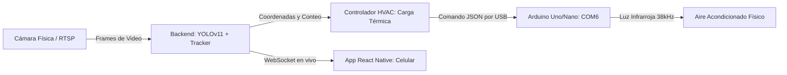

# Sistema Inteligente de Control de Aforo y Climatización Automatizada (HVAC)
## Documentación de Software y Manual de Usuario

Este documento detalla el funcionamiento técnico del software (Backend de Python y Firmware del Arduino) y proporciona un manual de usuario paso a paso para la correcta operación del sistema.

---

# 🧠 PARTE 1: DOCUMENTACIÓN TÉCNICA DEL SOFTWARE

El sistema es una solución ciberfísica integrada que combina **Inteligencia Artificial (Visión Computacional)**, **Comunicación en Tiempo Real (WebSockets)**, **Control Lógico Lento (Controlador HVAC)** y **Actuación Física (Microcontrolador IoT)**.



---

## 1. Detector de Inteligencia Artificial (Backend Python)
Ubicación principal: [app.py](file:///c:/Users/stefh/Desktop/app_aforo/backend/app.py)

El backend corre sobre un servidor **Flask** montado con hilos asíncronos bajo **Eventlet** para soportar flujos de alta concurrencia de WebSockets. 

### A. Bucle de Video y Detección
1. **Captura:** OpenCV (`cv2.VideoCapture`) extrae frames en vivo desde la cámara web o cámara IP configurada.
2. **Preprocesamiento:** Los frames se redimensionan en caliente a **`512px`** (una resolución optimizada que equilibra la velocidad de inferencia y la precisión para tarjetas gráficas de gama media como la GTX 1050 Ti).
3. **Inferencia (YOLOv11s):** El modelo procesa la imagen buscando objetos de la clase `person` (ID 0). Retorna los rectángulos contenedores (Bounding Boxes) y el nivel de confianza.
4. **Seguimiento (Tracker):** El archivo `LineCrossingTracker.js` / Python Tracker asocia las detecciones de frames consecutivos basándose en la distancia IOU (Intersection over Union). Esto previene falsos conteos si una persona es bloqueada momentáneamente por un obstáculo.

---

## 2. Controlador Lógico HVAC (Backend Python)
Ubicación principal: [hvac_controller.py](file:///c:/Users/stefh/Desktop/app_aforo/backend/core/hvac_controller.py)

Este módulo calcula las necesidades de enfriamiento basándose en la **Carga Térmica Humana** dentro de la habitación:

* **Ecuación Térmica:** Cada ser humano en estado de reposo o actividad ligera emite aproximadamente **70 Watts** de calor sensible en forma de radiación y convección.
  $$\text{Carga Humana (W)} = \text{Conteo de Personas} \times 70\text{ W}$$
* **Lógica de Decisión Dinámica:**
  * **Habitación Vacía (0 personas):** El sistema entra en modo de ahorro energético. Sube la temperatura del aire a **`26°C`** (o apaga el aire según configuración) para reducir el consumo eléctrico hasta un 30%.
  * **Aforo Bajo (1 - 5 personas):** Se configura una temperatura confortable de confort moderado: **`24°C`**.
  * **Aforo Alto (Más de 15 personas o >60% capacidad):** Se entra en modo enfriamiento rápido, bajando la temperatura a **`21°C - 22°C`** con ventilador en velocidad máxima para contrarrestar la carga térmica humana acumulada de forma inmediata.

---

## 3. Puente Serial USB (Backend Python)
Ubicación principal: [arduino_serial.py](file:///c:/Users/stefh/Desktop/app_aforo/backend/core/arduino_serial.py)

Administra la transmisión física de datos hacia el Arduino:
* Abre el puerto serial físico (ej. **`COM6`**) con velocidad de **`115200 baudios`**, control de paridad nulo y bits de parada estándar.
* **Envío Asíncrono:** Para evitar colgar el hilo del video de YOLO, los comandos de clima se encolan y se envían de forma asíncrona.
* **Control de Flujo ACK:** Al enviar un comando JSON por Serial, el puente de Python pausa y espera hasta recibir un mensaje de confirmación (`{"type":"ack", "success":true}`) desde el Arduino antes de marcar la transmisión como completada.

---

## 4. Firmware del Arduino (C++ Embebido)
Ubicación principal: [arduino_hvac_ir.ino](file:///c:/Users/stefh/Desktop/app_aforo/hardware/arduino_hvac_ir/arduino_hvac_ir.ino)

El Arduino ejecuta el **Protocolo Versión 2**, estructurado como una máquina de estados reactiva y sin bloqueos de reloj:

### A. Estructura de Mapeo C++
El firmware utiliza la librería `ArduinoJson` y cuenta con un helper inteligente llamado `getStringOr()` optimizado para evitar problemas de deducción de plantillas:
```cpp
const char *getStringOr(JsonDocument &doc, const char *shortKey, const char *longKey, const char *fallback) {
  const char *value = doc[shortKey].as<const char*>();
  if (value && value[0] != '\0') return value;
  value = doc[longKey].as<const char*>();
  if (value && value[0] != '\0') return value;
  return fallback;
}
```
Esto permite recibir formatos descriptivos del usuario o compactos del backend de forma indistinta.

### B. Ensamblado del Protocolo Infrarrojo de LG (28 bits)
Para controlar aires acondicionados LG de forma física nativa, el microcontrolador ensambla un número binario de 28 bits:
1. **Header Base:** `0x8800000`
2. **Modo de Operación (3 bits):** Mapea Cool (0), Dry (1), Fan (2), Heat (4).
3. **Temperatura (4 bits):** Resta 15 al valor Celsius recibido (ej. `24°C - 15 = 9` -> `1001` en binario).
4. **Ventilador (3 bits):** Mapea velocidades (Baja, Media, Alta, Auto).
5. **Checksum de Integridad (4 bits):** Suma aritmética de los valores de los parámetros en binario para validar la señal en el receptor.
   $$\text{Checksum} = (\text{Op} + \text{Modo} + \text{Temp} + \text{Fan}) \ \& \ \text{0x0F}$$
6. El número resultante de 28 bits es enviado usando la señal portadora modulada a 38kHz mediante:
   ```cpp
   IrSender.sendLG(0x88, (finalCode & 0xFFFFF), 0);
   ```

---

# 📱 PARTE 2: MANUAL DE USUARIO (GUÍA DE OPERACIÓN)

Sigue estos pasos para operar e interactuar con el sistema de manera correcta y segura.

## Paso 1: Preparación y Conexión del Hardware
1. Conecta tu **Arduino Uno/Nano** a un puerto USB libre de tu computadora mediante su cable.
2. Identifica en qué puerto COM se registró (por ejemplo, **`COM6`**). 
3. Asegúrate de conectar el **LED Infrarrojo de Transmisión** físicamente al **Pin Digital 9** del Arduino. 
   > [!IMPORTANT]
   > Conecta una resistencia de 100 o 220 ohmios en serie con la pata larga (ánodo) del LED IR para limitar la corriente y proteger tu microcontrolador.

---

## Paso 2: Lanzamiento del Sistema en la Computadora
El sistema requiere que el servidor central de Python y el servidor móvil de empaquetado React Native estén encendidos:

1. **Encender el Backend de Python:**
   * Abre tu terminal en la PC.
   * Navega a la carpeta del backend y escribe:
     ```bash
     cd backend
     python app.py
     ```
   * En los mensajes iniciales debes ver que el backend se conecta automáticamente a tu Arduino:
     `🔌 Conectando físicamente al Arduino en COM6...`
     `🔌 Estado de conexión al Arduino: {'success': True, 'connected': True, ...}`

2. **Encender la Aplicación Móvil:**
   * Abre otra terminal y escribe:
     ```bash
     cd frontend
     npm start
     ```
   * Escanea el código QR que se genera en pantalla con la aplicación **Expo Go** en tu celular Android o iOS.

---

## Paso 3: Operación desde tu Celular

### A. Panel Principal de Aforo (Dashboard)
Al abrir la aplicación en tu celular, verás el Panel Principal:
* **Video en Vivo:** Muestra el feed de la cámara web con rectángulos verdes sobre cada persona detectada por YOLOv11 en tiempo real.
* **Indicador de Aforo:** Muestra el número exacto de personas dentro del cuarto.
* **Botón de Climatización:** En la parte inferior, verás el botón verde **❄️ PANEL AIRE (HVAC)**. Presiónalo para abrir el módulo de clima.

### B. Control Manual del Aire Acondicionado
Una vez dentro del Panel HVAC:
1. **Verificar Estado de Conexión:**
   * En la parte superior derecha debes ver una insignia verde que dice **`SERIAL OK`**. Esto significa que tu celular tiene control total sobre el Arduino físico.
2. **Seleccionar Marca y Configuración:**
   * En **CONTROL MANUAL IR**, selecciona la marca de tu aire acondicionado (LG, Samsung, Haier o Genérico).
   * Modifica el encendido (**Power**), el modo de ventilación, la velocidad y la temperatura deseada (ej. `24°C`) usando los botones de `+` y `-`.
3. **Enviar la Señal:**
   * Presiona el botón verde grande **`ENVIAR COMANDO IR`**.
   * **¡Verás parpadear los LEDs TX/RX en tu Arduino y el LED infrarrojo enviará la señal real para configurar el aire acondicionado físico!**
   * Tu celular mostrará un popup verde que dice `🚀 Comando Enviado`.

### C. Activar el Modo Automático por Visión Artificial (IA)
Esta es la función principal del proyecto, donde la inteligencia artificial toma el control del clima sin intervención humana:
1. En el panel HVAC, asegúrate de que el **MODO AUTO** esté marcado como **`ACTIVADO`**.
2. Vuelve al inicio e inicia la cámara del aforo.
3. **¡Listo!** El backend de Python calculará de forma continua el aforo. Si detecta que entran personas (ej. de 0 a 6 personas), enviará comandos automáticos de forma serial al Arduino para enfriar el cuarto a `22°C`. Si la sala se vacía, enviará de inmediato un comando automático de ahorro de energía a `26°C`. Verás al Arduino parpadear de forma completamente inteligente cada vez que cambie la ocupación.

---

## 🛠️ PARTE 3: SOLUCIÓN DE PROBLEMAS (TROUBLESHOOTING)

> [!WARNING]
> **1. Al presionar "Enviar Comando Manual" sale la alerta "⚠️ Fallo el envío / Verifica la conexión serial"**
> * **Causa:** El Arduino no está conectado, está en el puerto incorrecto, o el cable USB se desconectó físicamente.
> * **Solución:** Verifica que el Arduino esté bien conectado al puerto USB de tu PC. Asegúrate de que el backend de Python muestre que está conectado a `COM6`. Si cambias de puerto COM, actualízalo en el backend.

> [!NOTE]
> **2. Intento subir un cambio de código al Arduino desde el Arduino IDE y me da error de "Puerto Ocupado / Access Denied"**
> * **Causa:** El servidor de Python (`python app.py`) está activo en tu PC y tiene el puerto `COM6` bloqueado para uso exclusivo.
> * **Solución:** Ve a la terminal del backend en tu computadora, presiona **`Ctrl + C`** para apagar temporalmente el servidor de Python. Esto liberará el puerto de inmediato. Sube el código en el Arduino IDE y luego vuelve a encender el backend con `python app.py`.

> [!TIP]
> **3. Presiono el botón manual, sale "🚀 Comando Enviado" en el celular, pero el Aire Acondicionado físico no se enciende**
> * **Causa:** El LED Infrarrojo está conectado en el pin equivocado, al revés, o el LED no está apuntando directamente al receptor del aire acondicionado.
> * **Solución:**
>   1. Confirma que el cable del LED IR esté conectado al **Pin Digital 9** en el Arduino (y no en el 3).
>   2. Confirma la polaridad del LED IR (la pata más larga debe ir al Pin 9 a través de la resistencia; la pata corta a GND).
>   3. Apunta el LED directamente hacia el aire acondicionado. Si la distancia es mayor a 1 metro, considera implementar el circuito de alta potencia con transistor (Opción B) descrito en la sección de Hardware.
